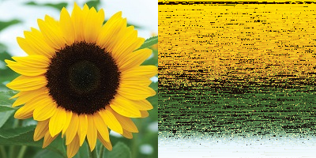

# Pixel Sorting by Selection Sort

This is a program in Processing which can order you all the pixels of an img and makes great forms and colors!

### Index

- [Formats](#formats)

- [Examples](#examples)

-----------------------------------------------------------------------

### Formats:

You can sort the pixels by the:
 - Hue: The color type, ranges from 0 to 255 by default.
 - Saturation: The vibrancy of the color, 0 to 255 by default.
 - Brightness: The, well, brightness of the color, 0 to 255 by default.

-----------------------------------------------------------------------

### Examples:

Some Rainbow colors example:

Bright sunflower example:

-----------------------------------------------------------------------

Good work!

Aleix Ferré Juan

