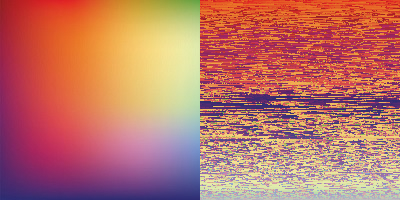

# PixelSorting-SelectionSort

This is a program in Processing which can order you all the pixels of an img and makes great forms and colors!

### Examples:

Some Rainbow colors example:

Bright sunflower example:

